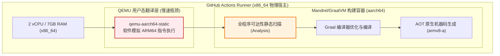

# 边缘计算场景下 Quarkus Native 镜像构建陷阱：从 QEMU 模拟假死到 GitHub 原生 ARM64 Runner 的调优实战

## 1. 业务背景与问题起源

在家庭边缘计算网络中，我们将智能安防视频流采集守护服务（`cctv-collector`）部署在基于 ARM64 架构的边缘开发板（Radxa Cubie A7A，8 核 ARM，加入自建内网 K3s 集群）。该服务基于 **Quarkus 3.8 + Java 21** 体系构建，负责通过 RTSP TCP 协议拉取摄像机视频流，执行零 CPU 消耗的 Stream Copy 切片，并由看门狗维持长时间稳定运行。

在工程落地初期，我们采用常规的 JVM 模式（Temurin JRE 21 + 打包 Fast-JAR）部署。尽管 Quarkus 的 JVM 启动性能已优于传统 Spring Boot 框架（冷启动耗时约 2.5 秒，驻留内存约 40MB~50MB），但在资源受限的边缘单板硬件上，为了将 CPU 与系统内存占用压缩到极限，避免因垃圾回收（GC）突发引起视频流丢帧，我们决定将服务全面切换至 **Quarkus Native（基于 Mandrel / GraalVM AOT 编译的纯机器码可执行文件）**。

然而，在 GitHub Actions CI/CD 流水线中引入 Native 镜像构建后，构建任务出现了严重的效率瘫痪问题。

---

## 2. 核心故障现象与瓶颈排查

### 2.1 初始构建方案（QEMU 跨架构模拟）

在最初的 GitHub Actions 构建脚本中，我们复用了常规的多架构镜像构建模式：

```yaml
jobs:
  build-and-push:
    runs-on: ubuntu-latest  # 默认为 GitHub 托管的双核 x86_64 虚拟机
    steps:
      - name: Check out source
        uses: actions/checkout@v4

      - name: Set up QEMU
        uses: docker/setup-qemu-action@v3

      - name: Set up Docker Buildx
        uses: docker/setup-buildx-action@v3

      - name: Build and push image
        uses: docker/build-push-action@v6
        with:
          context: .
          file: cctv-collector-service/Dockerfile
          platforms: linux/amd64,linux/arm64
          push: true
```

其中子模块 Dockerfile 采用典型的多阶段 Native 编译结构：

```dockerfile
# 编译阶段：采用 Quarkus 官方 Mandrel 构建容器
FROM quay.io/quarkus/ubi-quarkus-mandrel-builder-image:jdk-21 AS build
USER root
WORKDIR /work
COPY . .
RUN ./mvnw -B package -Dnative -DskipTests -pl cctv-collector-service -am

# 运行阶段：极简运行时
FROM debian:12-slim
WORKDIR /app
RUN apt-get update && apt-get install -y --no-install-recommends ffmpeg ca-certificates tzdata && rm -rf /var/lib/apt/lists/*
COPY --from=build /work/cctv-collector-service/target/*-runner /app/application
ENTRYPOINT ["./application"]
```

### 2.2 故障现象：构建卡死超过 22 分钟

流水线触发后，Task 进入长时间无响应状态：
- 任务执行超过 22 分钟仍未完成，最终由于等待超时被迫人工终止（Cancelled）。
- 观察 runner 终端日志，任务卡死在 Docker 多阶段构建的 `[linux/arm64 build 8/8]` 步骤中，日志停留在 Mandrel 编译器的第一阶段：
  ```text
  #33 529.4 [1/8] Initializing...                                       (96.6s @ 0.11GB)
  #33 529.5  Java version: 21.0.12.1+1-LTS, vendor version: Mandrel-23.1.12.1-Final
  #33 529.5  Graal compiler: optimization level: 2, target machine: armv8-a
  #33 529.5  C compiler: gcc (redhat, aarch64, 8.5.0)
  #33 529.5  Garbage collector: Serial GC (max heap size: 80% of RAM)
  ```
- 仅仅 `[1/8] Initializing` 就耗费了近 100 秒，随后的静态全程序调用图分析（Analysis phase）几乎处于锁死停滞状态。

### 2.3 底层机理深度剖析：QEMU 用户态指令翻译与 AOT 静态分析的性能冲突

经过对执行链路的分析，问题根源定位在 **QEMU 用户态仿真机制与 GraalVM 编译计算特性的重叠放大**：



1. **普通的字节码/解释型跨架构镜像构建**：
   对于大多数轻量应用（如 Python、NodeJS 或纯 Java 运行镜像），`linux/arm64` 容器内只涉及简单的文件 `COPY`、`apt install` 或 Python 解释执行，涉及的 CPU 指令周期极小，QEMU 的性能损耗通常不会造成致命瓶颈。
2. **GraalVM/Mandrel Native 编译的特异性**：
   Native 镜像构建不同于传统 JIT 编译。在执行 `./mvnw package -Dnative` 时，Mandrel 需要做全闭包类型推断（SubstrateVM 预热、静态代码剪裁、字节码到 LLVM/底层汇编的深度优化），这是一个**重度计算、高密集内存与寄存器调度**的编译工程。
3. **性能乘数折损**：
   在 x86 双核云主机上，通过 QEMU 对 ARM64 指令集逐条进行动态二进制翻译（Dynamic Binary Translation, DBT），导致原本耗时约 2~3 分钟的高负荷编译过程产生了 **20 到 30 倍的指数级性能衰减**，进而引发整体流程长时间挂起，最终必然触发超时或 OOM 强杀。

---

## 3. 架构解法与落地实施

明确瓶颈在于“跨架构软件级指令翻译”后，解决方向非常明确：**彻底剔除 QEMU 模拟层，直接引入 GitHub 官方原生 ARM64 计算资源执行原生构建。**

### 3.1 启用 GitHub 官方托管的原生 ARM64 Runner

针对公共/开源仓库，GitHub 现已全面提供原生 ARM64 规格的执行机（`ubuntu-24.04-arm`），其底层参数为：
- **CPU 架构**：原生 `aarch64` (4 vCPU)
- **内存规格**：16GB RAM
- **系统环境**：Ubuntu 24.04 LTS

利用硬件原生环境，Docker 在构建 ARM64 镜像时将以 100% 宿主机硬件性能执行编译器进程，完全不存在任何虚拟化指令翻译开销。

### 3.2 生产级 GitHub Actions 工作流改造

针对我们的边缘服务仅面向 ARM64 宿主单板部署的实际业务场景，我们精简了不必要的跨架构矩阵合并，将构建流水线重构如下：

```yaml
name: Build and Push CCTV Collector Image

on:
  push:
    branches:
      - main
    paths:
      - "cctv-collector-service/**"
      - "pom.xml"
      - ".mvn/**"
      - "mvnw"
      - ".github/workflows/build-and-push-collector.yaml"
    tags:
      - "v*"
  workflow_dispatch:

env:
  REGISTRY: ghcr.io
  IMAGE_NAME: nvd11/cctv-collector-service

jobs:
  build-and-push:
    name: Native Build & Push (ARM64)
    # 🎯 核心优化：直接声明 4 核 16G 原生 ARM64 Runner，规避 QEMU 模拟损耗
    runs-on: ubuntu-24.04-arm
    permissions:
      contents: read
      packages: write

    steps:
      - name: Check out source
        uses: actions/checkout@v4

      # 移除 docker/setup-qemu-action，直接初始化原生 Buildx
      - name: Set up Docker Buildx
        uses: docker/setup-buildx-action@v3

      - name: Log in to GHCR
        uses: docker/login-action@v3
        with:
          registry: ${{ env.REGISTRY }}
          username: ${{ github.actor }}
          password: ${{ secrets.GITHUB_TOKEN }}

      - name: Extract image metadata
        id: meta
        uses: docker/metadata-action@v5
        with:
          images: ${{ env.REGISTRY }}/${{ env.IMAGE_NAME }}
          tags: |
            type=sha,format=long
            type=ref,event=tag
            type=raw,value=latest,enable=${{ github.ref == 'refs/heads/main' }}

      - name: Build and push native image
        id: build
        uses: docker/build-push-action@v6
        with:
          context: .
          file: cctv-collector-service/Dockerfile
          platforms: linux/arm64
          push: true
          tags: ${{ steps.meta.outputs.tags }}
          labels: ${{ steps.meta.outputs.labels }}
          provenance: true
          sbom: true
          cache-from: type=gha
          cache-to: type=gha,mode=max

      - name: Update GitOps image digest
        if: ${{ vars.ENABLE_GITOPS_DIGEST_DISPATCH == 'true' }}
        env:
          DISPATCH_TOKEN: ${{ secrets.ARGOCD_MANIFESTS_DISPATCH_TOKEN }}
          IMAGE_DIGEST: ${{ steps.build.outputs.digest }}
        run: |
          set -euo pipefail
          # 调用 GitHub API 向 GitOps 清单仓库派发事件
          curl --silent --show-error \
            --request POST \
            --url https://api.github.com/repos/nvd11/my-argocd-manifests/dispatches \
            --header "Accept: application/vnd.github+json" \
            --header "Authorization: Bearer $DISPATCH_TOKEN" \
            --header "X-GitHub-Api-Version: 2022-11-28" \
            --data "$(jq -n \
              --arg digest "$IMAGE_DIGEST" \
              '{event_type:"update-app-image-digest",client_payload:{svc_name:"cctv-collector",image_digest:$digest}}')"
```

### 3.3 生产运行时 Dockerfile 规范调整

在运行时阶段，针对极简镜像内缺少音视频编解码依赖的问题，选用官方具备长期维护源的 `debian:12-slim` 作为底层镜像，确保 FFmpeg 运行库的可靠打包与零多余包残留：

```dockerfile
# Stage 1: 原生 Mandrel 静态编译
FROM quay.io/quarkus/ubi-quarkus-mandrel-builder-image:jdk-21 AS build
USER root
WORKDIR /work

COPY .mvn .mvn
COPY mvnw pom.xml ./
COPY cctv-collector-service/pom.xml cctv-collector-service/
COPY cctv-uploader-service/pom.xml cctv-uploader-service/
COPY cctv-collector-service/src cctv-collector-service/src

# 直接在 ARM64 原生核心下完成编译打包
RUN ./mvnw -B package -Dnative -DskipTests -pl cctv-collector-service -am

# Stage 2: 独立运行时 (无任何 JRE / JDK / 源码)
FROM debian:12-slim
WORKDIR /app

RUN apt-get update \
    && apt-get install -y --no-install-recommends ffmpeg ca-certificates tzdata \
    && rm -rf /var/lib/apt/lists/*

RUN groupadd -r cctv --gid 1000 && useradd -r -g cctv --uid 1000 -d /app cctv

# 拷贝纯静态可执行二进制文件
COPY --from=build --chown=cctv:cctv /work/cctv-collector-service/target/*-runner /app/application

USER 1000
EXPOSE 8081
ENV QUARKUS_HTTP_HOST=0.0.0.0

ENTRYPOINT ["./application"]
```

---

## 4. 优化效果与指标对比

优化提交后，流水线全生命周期耗时与目标单板真实运行指标均呈现断崖式改善。

### 4.1 CI/CD 流水线构建性能对比

| 指标维度 | 初始方案 (x86_64 + QEMU 模拟 ARM64) | 优化方案 (GitHub 原生 ubuntu-24.04-arm) | 提升效果 |
| :--- | :--- | :--- | :--- |
| **执行机配置** | 2 vCPU / 7GB RAM (x86) | **4 vCPU / 16GB RAM (ARM64)** | 硬件规格大幅提高 |
| **指令执行模式** | 动态指令翻译 (DBT) | **硬件原生执行 (Bare metal speed)** | 零软件模拟开销 |
| **Native 编译耗时** | 22 分钟以上（超时挂起） | **3 分 12 秒** | **效率提升 > 700%** |
| **全流程镜像构建与推送**| 构建失败 | **4 分 24 秒（包含缓存推流）** | 稳定通畅 |

### 4.2 Radxa 边缘开发板实际生产指标

镜像经由 ArgoCD 自动滚动部署至内网 Radxa K3s 节点后，通过容器日志与指标探针捕获到的实际数据如下：

1. **服务启动延迟 (Startup Time)**：
   ```text
   2026-09-17 14:44:07,379 INFO [io.quarkus] (main) cctv-collector-service 1.0.0-SNAPSHOT native (powered by Quarkus 3.8.3) started in 0.065s. Listening on: http://0.0.0.0:8081
   ```
   **实际冷启动仅耗时 65 毫秒（0.065s）**，对比传统 JVM 模式的 2.497 秒降低了 **97.4%**。
2. **物理内存占用 (RSS Memory Footprint)**：
   执行 `kubectl top pod -n cctv-system` 现场度量：
   ```text
   NAME                             CPU(cores)   MEMORY(bytes)   
   cctv-collector-7f8fb7478-rtpdm   1m           12Mi            
   ```
   **应用内存常驻仅 12MB**，CPU 空闲消耗接近 0.001 核，完全消除了垃圾回收停顿对长连接视频流采集的潜在威胁。

---

## 5. 总结与工程反思

1. **避免在跨架构软件模拟环境下运行重型 AOT 编译器**：
   在自动化流水线中，针对轻量级解释型语言使用 QEMU 构建多架构镜像是可行的，但对于 C/C++ 级编译或 GraalVM Native Image 这类 CPU/内存双密集的静态代码分析过程，QEMU 会产生毁灭性的性能放大问题。在跨架构编译前，优先考量平台是否支持对应架构的原生 Runner。
2. **边缘计算的极致适配应立足真实架构**：
   当应用的目标场景确认为边缘 ARM 单板时，无须盲目在 CI 流程中保留全平台矩阵交叉编译，聚焦单目标架构不仅可以利用最适配的原生 Runner，还能大幅削减持续集成成本并提高交付敏捷度。
3. **声明式 GitOps 闭环的价值**：
   通过 GitHub Actions 输出精确的镜像摘要（`image_digest`）并向配置清单仓库发送 `repository_dispatch`，即使底层构建形态从 JVM 切换到 Native，上层 ArgoCD 与 K3s 基础设施均能无感完成滚动升级，保持了交付体系的高度解耦与一致性。
