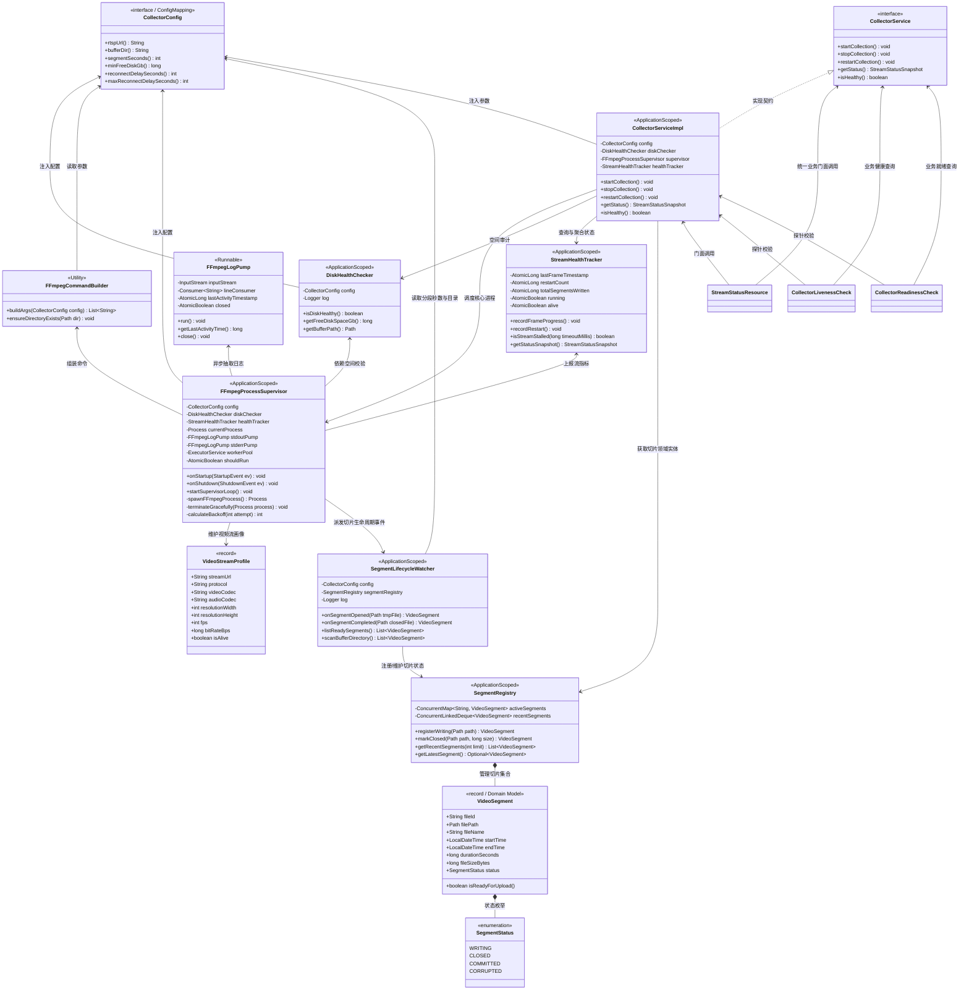
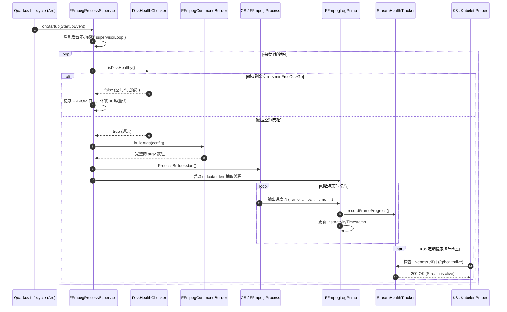

# 🏛️ CCTV Collector 详细类设计说明书 (Class Design Document)

## 1. 设计原则与运行约束

本系统作为家庭局域网 7×24 小时无人值守运行的安防流媒体切片守护服务，运行于资源受限的 ARM64 边缘单板（Radxa Cubie A7A / K3s 环境），并采用 **Quarkus 3.8 Native (GraalVM/Mandrel)** 静态编译。整体类设计严格恪守以下三大工业级工程准则：

1. **AOT 静态编译与零反射约束 (SubstrateVM Friendly)**：
   - 杜绝动态类加载、复杂运行时反射和动态代理。
   - 配置体系采用 Quarkus 官方编译期代码生成的 `@ConfigMapping` 接口模型，规避传统 Spring 风格的动态属性注入。
   - 依赖注入全面基于 Quarkus Arc（编译期静态 CDI 容器），实现极速冷启动与微秒级 Bean 依赖绑定。
2. **外部进程独立托管与容器预装体系 (Out-of-Process Supervision)**：
   - **不采用 JNI 绑定（如 JavaCV）**：避免 RTSP 坏流导致底层的 C 语言段错误（Segmentation Fault）连带让整个 Java 虚拟机直接崩溃。
   - **操作系统级解耦**：容器基础镜像（`debian:12-slim`）预装官方编译的 `/usr/bin/ffmpeg`（实测版本 5.1.9）；Java 服务作为**主控大脑与看门狗**，通过标准 `ProcessBuilder` 调起和托管独立的 `ffmpeg` 进程。
   - **管道缓冲区防死锁**：必须规避 Linux Pipe 缓冲区（通常为 64KB）因日志堆积引发的进程假死死锁。
   - 针对家庭 Wi-Fi 抖动、摄像机定时重启或微弱丢包，看门狗采用有限状态机与指数退避（Exponential Backoff）自愈循环。
3. **云原生健康契约闭环 (MicroProfile Health Contract)**：
   - 将内部看门狗的心跳感知（流存活）与磁盘熔断状态，分别桥接至 MicroProfile `@Liveness` 与 `@Readiness` 标准探针，实现与 K3s 控制面的故障自愈闭环。

---

## 2. 核心类图 (UML Class Diagram)



---

## 3. 组件时序与生命周期流 (Sequence Diagram)

### 3.1 启动与正常切片循环时序



### 3.2 摄像机断网异常与指数退避时序

```mermaid
sequenceDiagram
    autonumber
    participant Process as FFmpeg Process
    participant Super as FFmpegProcessSupervisor
    participant Tracker as StreamHealthTracker
    participant K3s as K3s Kubelet

    Note over Process: 局域网摄像机断电 / Wi-Fi 闪断
    Process-->>Super: 进程退出 (exitCode != 0)
    deactivate Process
    Super->>Tracker: recordRestart()
    
    Super->>Super: 计算指数退避等待时长 (5s -> 10s -> 20s... max 60s)
    
    opt 退避超长且无帧到达
        K3s->>Tracker: GET /q/health/live (超时阈值 60s)
        Tracker-->>K3s: 503 DOWN (Stream Stalled)
        K3s->>Super: 发送 SIGTERM 重建 Pod 兜底
    end

    Super->>Process: 重新拉起 ProcessBuilder.start()
    activate Process
    Note over Super: 恢复推流，重置退避计数器
```

### 3.3 容器销毁与优雅停机时序 (Graceful Shutdown)

```mermaid
sequenceDiagram
    autonumber
    participant K3s as K3s / Docker Daemon
    participant Super as FFmpegProcessSupervisor
    participant Process as FFmpeg Process
    participant FS as Buffer Volume (/mnt/buffer/cctv)

    K3s->>Super: SIGTERM 信号 / onShutdown(ShutdownEvent)
    activate Super
    Super->>Super: shouldRun.set(false)
    Super->>Process: 向 stdin 输入字符 'q'
    Note over Process: FFmpeg 接收到 'q'，开始封装当前正在写入的 MP4 尾部
    Process->>FS: 刷新并闭合 moov atom 索引头
    
    alt FFmpeg 5 秒内自愿安全退出
        Process-->>Super: Process terminated (exitCode = 0)
        deactivate Process
    else 5 秒超时强杀兜底
        Super->>Process: process.destroyForcibly() (SIGKILL)
    end
    Super-->>K3s: Java 进程退出，Pod 终结
    deactivate Super
```

---

---

## 4. 视频流与切片领域模型 (Domain Model Specifications)

针对主人关注的核心：**“如何精确描述实时视频流属性？”** 与 **“如何建模与追踪每一个落盘的切片文件（如 1 分钟 / 15 分钟切片）？”**，系统抽象了专门的强类型领域模型与状态机：

### 4.1 `VideoStreamProfile` (视频流核心画像)
- **包路径**：`com.gateman.cctv.collector.model`
- **定位**：**不可变领域模型 (Java 21 Record)**
- **职责**：高保真刻画正在接入的 RTSP 视频流的技术规格与链路健康度：
  - `streamUrl`: RTSP 连接地址（已脱敏）；
  - `protocol`: 传输层协议（固定为 `"RTSP/TCP"`）；
  - `videoCodec`: 视频编码（如 `"H.265 (HEVC)"`）；
  - `audioCodec`: 音频编码（如 `"AAC (16000Hz)"`）；
  - `resolutionWidth` / `resolutionHeight`: 视频分辨率（如 `2560 x 1440 (2.5K)`）；
  - `fps`: 帧率（如 `15` fps）；
  - `bitRateBps`: 实时码率（约 `1.5 Mbps`）；
  - `isAlive`: 当前推流物理状态是否活跃。

---

### 4.2 `VideoSegment` (分段切片领域实体)
- **包路径**：`com.gateman.cctv.collector.model`
- **定位**：**切片生命周期核心实体 (Java 21 Record)**
- **职责**：完整描述磁盘上每一个正在生成、或者已经闭合的切片物理文件：
  - `fileId`: 切片唯一标识（根据命名时间戳生成，如 `seg_20260917_150000`）；
  - `filePath`: 磁盘绝对物理路径（如 `/mnt/buffer/cctv/cctv_20260917_150000.mp4`）；
  - `fileName`: 文件全名；
  - `startTime`: 切片起始时间点；
  - `endTime`: 切片闭合时间点；
  - `durationSeconds`: 实际分段时长（如配置为 `60` 秒即为 1 分钟每段，默认 900 秒）；
  - `fileSizeBytes`: 文件物理大小（字节）；
  - `status`: 当前生命周期状态（`SegmentStatus` 枚举）；
  - `boolean isReadyForUpload()`: 便捷判定方法（当且仅当状态为 `CLOSED` 且文件大小 > 0 时返回 `true`，可安全交由下阶段 Uploader 上传）。

---

### 4.3 `SegmentStatus` (切片生命周期枚举)
- **状态流转**：
  ```text
  [FFmpeg 正在写入] WRITING 
          ↓ (达到 1min/15min 切片时间戳)
  [FFmpeg 闭合文件头] CLOSED (此时可安全上传)
          ↓ (被 Uploader 消费)
  [上传完成并确认] COMMITTED ➔ 自动清理
          ↓ (异常断电或不完整损坏)
  [残缺文件] CORRUPTED
  ```

---

### 4.4 `SegmentRegistry` & `SegmentLifecycleWatcher` (切片注册与监听仓储)
- **定位**：内存中高并发线程安全的切片状态仓储
- **职责**：
  - `SegmentRegistry`：在内存维护最近已完成切片队列（`recentSegments`），上层 API 可以随时查看“刚刚 1 分钟前保存了哪个视频、文件多大、时长多少”；
  - `SegmentLifecycleWatcher`：监听磁盘文件生成与关闭事件，完成切片实体的瞬时封装与流转。

---

## 5. 各核心控制器与服务技术规格定义

### 4.1 `CollectorConfig` (接口)
- **包路径**：`com.gateman.cctv.collector.config`
- **注解**：`@ConfigMapping(prefix = "cctv")`
- **设计要点**：
  - 映射 `application.properties` 及 K3s ConfigMap 环境变量；
  - 属性名称采用烤肉串式（kebab-case），Quarkus 会自动将其与环境变量的大写下划线格式（如 `CCTV_RTSP_URL`）完成高效映射。
- **方法签名**：
  - `String rtspUrl()`: RTSP 流连接串。
  - `String bufferDir()`: 切片输出缓冲根目录。
  - `int segmentSeconds()`: 切片时长，默认 900 秒。
  - `long minFreeDiskGb()`: 磁盘可用空间报警熔断阈值，默认 5GB。
  - `int reconnectDelaySeconds()`: 初始重试退避秒数，默认 5 秒。
  - `int maxReconnectDelaySeconds()`: 最大重试退避上限，默认 60 秒。

---

### 4.2 `DiskHealthChecker` (类)
- **包路径**：`com.gateman.cctv.collector.supervisor`
- **作用域**：`@ApplicationScoped`
- **设计要点**：
  - 本地单板挂载目录探测，避免由于 NFS/HostPath 挂载点脱落或磁盘被切片打满导致宿主机宕机；
  - 提供不可变的空间数值读取。
- **关键方法**：
  - `public boolean isDiskHealthy()`: 探测 `bufferDir` 所在文件系统的 `getUsableSpace()`，换算为 GB 并与 `minFreeDiskGb` 比较。
  - `public long getFreeDiskSpaceGb()`: 返回当前剩余空间数值，供 API 观测。

---

### 4.3 `FFmpegCommandBuilder` (工具类)
- **包路径**：`com.gateman.cctv.collector.supervisor`
- **特性**：无状态纯函数工具类
- **设计要点**：
  - 负责严格拼装符合安防标准的 FFmpeg 参数矩阵，强制走 TCP 避免 UDP 丢包导致的马赛克与绿屏；
  - 使用 `-strftime 1` 配合 `cctv_%Y%m%d_%H%M%S.mp4` 保证原子切片文件名天然具备时间可排序性。
- **关键方法**：
  - `public static List<String> buildArgs(CollectorConfig config)`: 返回标准 `List<String>` 供 `ProcessBuilder` 消费。

---

### 4.4 `FFmpegLogPump` (类)
- **包路径**：`com.gateman.cctv.collector.supervisor`
- **特性**：实现 `Runnable`，独立线程运行
- **设计要点**：
  - FFmpeg 将推流元数据与进度统计输出至 `stderr`，若不持续清空管道，Linux 默认的 64KB Pipe Buffer 填满后将导致操作系统阻塞子进程；
  - 解析进度文本（如 `frame=` 或 `time=`），实时驱动心跳更新。
- **关键字段与方法**：
  - `private final AtomicLong lastActivityTimestamp`: 毫秒级时间戳。
  - `public void run()`: 使用 `BufferedReader.readLine()` 循环消费并分发日志。
  - `public long getLastActivityTime()`: 供外部判定流是否产生僵死。

---

### 4.5 `StreamHealthTracker` (类)
- **包路径**：`com.gateman.cctv.collector.supervisor`
- **作用域**：`@ApplicationScoped`
- **设计要点**：
  - 线程安全指标收集器，解耦看门狗和对外 HTTP 状态查询；
  - 记录重启频次、运行累计时长、切片完成计数等。
- **关键方法**：
  - `public void recordFrameProgress()`: 刷新最新帧到达时间。
  - `public boolean isStreamStalled(long timeoutMillis)`: 判定是否超过阈值无数据（默认 60 秒），作为 Liveness 探针依据。

---

### 4.6 `FFmpegProcessSupervisor` (类)
- **包路径**：`com.gateman.cctv.collector.supervisor`
- **作用域**：`@ApplicationScoped`
- **设计要点**：
  - 整个子服务的核心控制器（Master Watchdog）；
  - 监听 Quarkus 生命周期注解 `@Observes StartupEvent` 与 `@Observes ShutdownEvent`；
  - 维护非阻塞重连循环，防止进程退出后容器退出导致被 K8s CrashLoopBackOff 惩罚；
  - 实现向子进程 stdin 发送字符 `'q'` 的优雅停机逻辑，避免 MP4 文件头部索引损坏。

---

### 4.7 `CollectorService` (接口) 与 `CollectorServiceImpl` (实现类)
- **包路径**：`com.gateman.cctv.collector.service`
- **定位**：**业务领域门面服务 (Domain Service Facade)**
- **设计要点**：
  - 遵循清晰的“Controller/Resource -> Service -> Supervisor/Infrastructure”分层架构。
  - 将底层进程管控、磁盘审计、指标汇总聚合为标准的业务方法，上层 Resource 和 HealthCheck 无须直接耦合底层的 Process 和 Supervisor 细节。
- **方法签名**：
  - `void startCollection()`: 启动采集业务。
  - `void stopCollection()`: 停止采集业务。
  - `void restartCollection()`: 人工/运维重启采集业务。
  - `StreamStatusSnapshot getStatus()`: 组装返回包含流状态、已切片数、磁盘余量等全量业务快照。
  - `boolean isHealthy()`: 综合业务健康度判定。

---

### 4.8 `CollectorLivenessCheck` & `CollectorReadinessCheck` (类)
- **包路径**：`com.gateman.cctv.collector.health`
- **注解**：分别标注 `@Liveness` 与 `@Readiness`
- **设计要点**：
  - 接入 MicroProfile Health 规范，自动向 Quarkus 暴露 `/q/health/live` 与 `/q/health/ready`；
  - 统一委托给 `CollectorService.isHealthy()` 与就绪校验，解耦底层细节。

---

### 4.9 `StreamStatusResource` (类)
- **包路径**：`com.gateman.cctv.collector.resource`
- **注解**：`@Path("/api/status")`
- **设计要点**：
  - 门面 REST API，纯粹调用 `CollectorService.getStatus()`，对外返回标准 JSON 监控数据。

---

## 5. 存储与文件状态流转规范

切片文件直接写入缓冲卷，文件名规范与生命周期如下：

```text
/mnt/buffer/cctv/
├── cctv_20260917_150000.mp4    [已闭合分段: 供下一步 Uploader 异步消费]
├── cctv_20260917_151500.mp4    [已闭合分段: 供下一步 Uploader 异步消费]
└── cctv_20260917_153000.mp4    [当前正在写入分段: FFmpeg 句柄占用中]
```

- 切片切换瞬间由 FFmpeg 底层的 segment muxer 原生无缝过渡；
- 停机时向 stdin 注入 `'q'` 保证正在写的最后一个分段也拥有合法的 `moov atom`，可直接播放。
