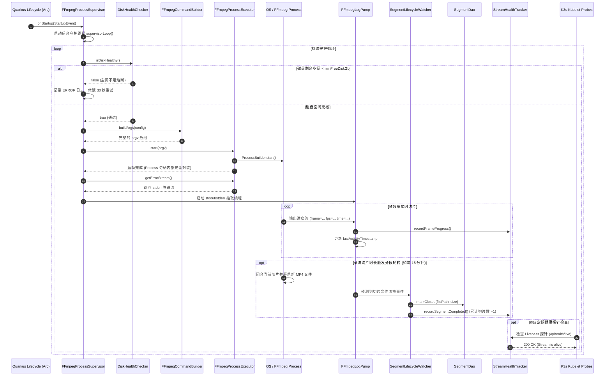
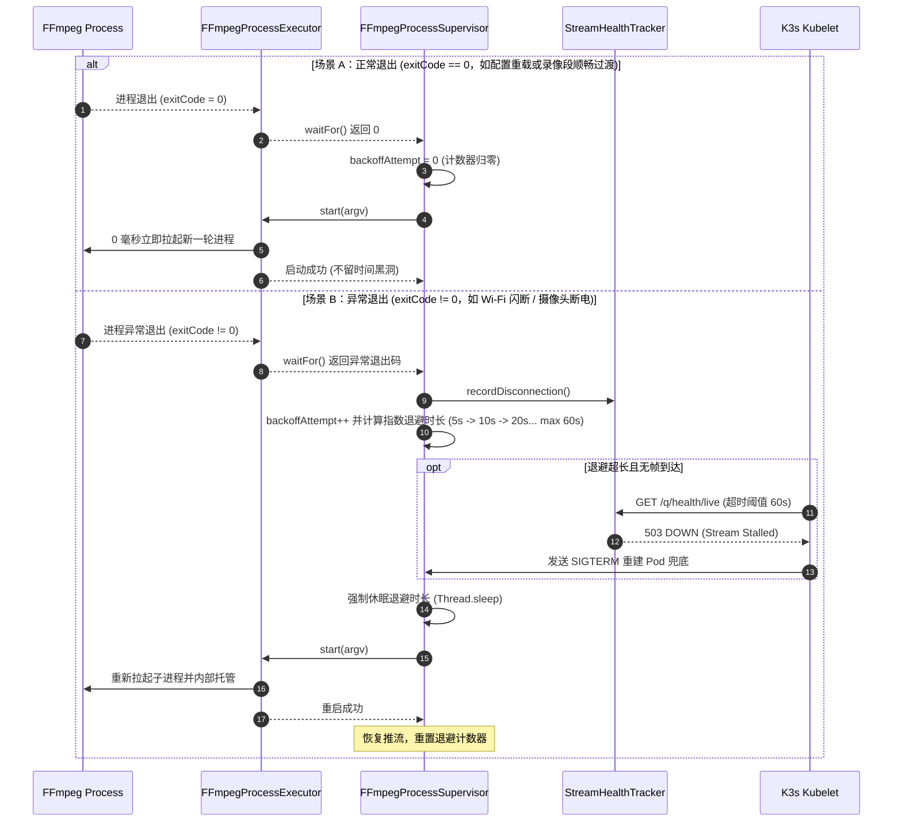
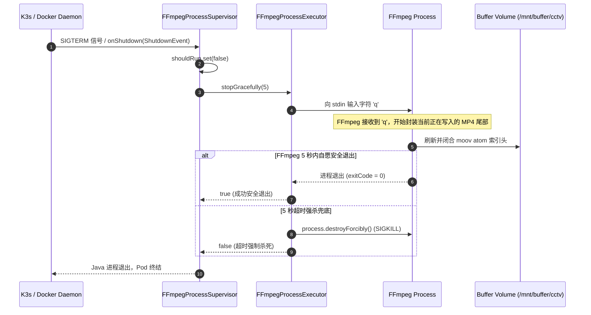
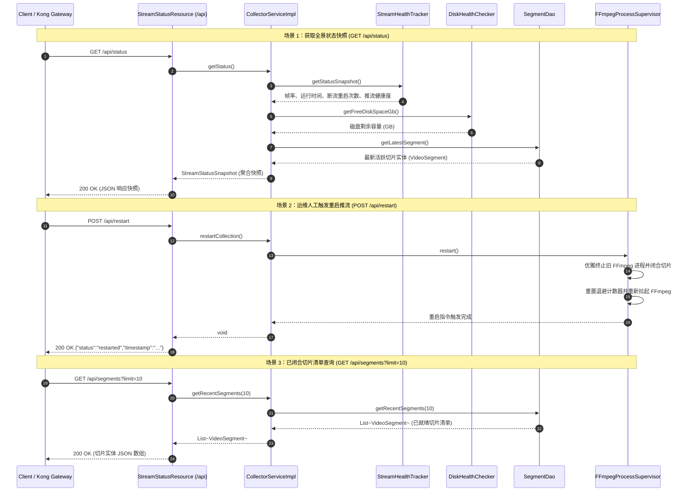

# 🏛️ CCTV Collector 详细类设计说明书 (Class Design Document)

## 1. 设计原则与运行约束

本系统作为家庭局域网 7×24 小时无人值守运行的安防流媒体切片守护服务，运行于资源受限的 ARM64 边缘单板（Radxa Cubie A7A / K3s 环境），并采用 **Quarkus 3.8 Native (GraalVM/Mandrel)** 静态编译。整体类设计严格恪守以下三大工业级工程准则：

1. **AOT 静态编译与零反射约束 (SubstrateVM Friendly)**：
   - 杜绝动态类加载、复杂运行时反射和动态代理。
   - 配置体系采用 Quarkus 官方编译期代码生成的 `@ConfigMapping` 接口模型，规避传统 Spring 风格的动态属性注入。
   - 依赖注入全面基于 Quarkus Arc（编译期静态 CDI 容器），实现极速冷启动与微秒级 Bean 依赖绑定。
2. **外部进程独立托管与容器预装体系 (Out-of-Process Supervision)**：
   - **不采用 JNI 绑定（如 JavaCV）**：避免 RTSP 坏流导致底层的 C 语言段错误（Segmentation Fault）连带让整个 Java 虚拟机直接崩溃。
   - **操作系统级解耦**：容器基础镜像（`debian:12-slim`）预装官方编译的 `/usr/bin/ffmpeg`（实测版本 5.1.9）；Java 服务作为**主控大脑与看门狗**，通过标准 `ProcessBuilder` 调起和托管独立的 `ffmpeg` 进程。
   - **管道缓冲区防死锁**：必须规避 Linux Pipe 缓冲区（通常为 64KB）因日志堆积引发的进程假死死锁。
   - 针对家庭 Wi-Fi 抖动、摄像机定时重启或微弱丢包，看门狗采用有限状态机与指数退避（Exponential Backoff）自愈循环。
3. **云原生健康契约闭环 (MicroProfile Health Contract)**：
   - 将内部看门狗的心跳感知（流存活）与磁盘熔断状态，分别桥接至 MicroProfile `@Liveness` 与 `@Readiness` 标准探针，实现与 K3s 控制面的故障自愈闭环。

---

## 2. 核心类图 (UML Class Diagram)

```mermaid
classDiagram
    direction TB

    class CollectorConfig {
        <<interface / ConfigMapping>>
        +rtspUrl() String
        +bufferDir() String
        +segmentSeconds() int
        +minFreeDiskGb() long
        +reconnectDelaySeconds() int
        +maxReconnectDelaySeconds() int
    }

    class DiskHealthChecker {
        <<ApplicationScoped>>
        -CollectorConfig config
        -Logger log
        +isDiskHealthy() boolean
        +getFreeDiskSpaceGb() long
        +getBufferPath() Path
    }

    class FFmpegCommandBuilder {
        <<Utility>>
        +buildArgs(CollectorConfig config) List~String~
        +ensureDirectoryExists(Path dir) void
        +resolveOutputPathPattern(String bufferDir) String
    }

    class FFmpegProcessExecutor {
        <<Dependent / Process Wrapper>>
        -Process currentProcess
        -Logger log
        +start(List~String~ commandArgs) void
        +waitFor() int
        +stopGracefully(long timeoutSeconds) boolean
        +isAlive() boolean
        +destroyForcibly() void
        +getErrorStream() InputStream
        +getPid() long
    }

    class VideoStreamProfile {
        <<record>>
        +String streamUrl
        +String protocol
        +String videoCodec
        +String audioCodec
        +int resolutionWidth
        +int resolutionHeight
        +int fps
        +long bitRateBps
        +boolean isAlive
    }

    class VideoSegment {
        <<record / Domain Model>>
        +String fileId
        +Path filePath
        +String fileName
        +LocalDateTime startTime
        +LocalDateTime endTime
        +long durationSeconds
        +long fileSizeBytes
        +SegmentStatus status
        +boolean isReadyForUpload()
    }

    class SegmentStatus {
        <<enumeration>>
        WRITING
        CLOSED
        COMMITTED
        CORRUPTED
    }

    class SegmentLifecycleWatcher {
        <<ApplicationScoped>>
        -CollectorConfig config
        -SegmentDao segmentDao
        -Logger log
        +onSegmentOpened(Path tmpFile) VideoSegment
        +onSegmentCompleted(Path closedFile) VideoSegment
        +listReadySegments() List~VideoSegment~
        +scanBufferDirectory() List~VideoSegment~
    }

    class SegmentDao {
        <<ApplicationScoped / DAO>>
        -ConcurrentMap~String, VideoSegment~ activeSegments
        -ConcurrentLinkedDeque~VideoSegment~ recentSegments
        +registerWriting(Path path) VideoSegment
        +markClosed(Path path, long size) VideoSegment
        +getRecentSegments(int limit) List~VideoSegment~
        +getLatestSegment() Optional~VideoSegment~
        +findReadyForUpload() List~VideoSegment~
        +count() long
    }

    class FFmpegLogPump {
        <<Runnable>>
        -InputStream inputStream
        -Consumer~String~ lineConsumer
        -AtomicLong lastActivityTimestamp
        -AtomicBoolean closed
        +run() void
        +getLastActivityTime() long
        +close() void
    }

    class StreamHealthTracker {
        <<ApplicationScoped>>
        -AtomicLong lastFrameTimestamp
        -AtomicLong restartCount
        -AtomicLong totalSegmentsWritten
        -AtomicBoolean running
        -AtomicBoolean alive
        +recordFrameProgress() void
        +recordDisconnection() void
        +recordRestart() void
        +recordSegmentCompleted() void
        +isStreamStalled(long timeoutMillis) boolean
        +getStatusSnapshot() StreamStatusSnapshot
    }

    class FFmpegProcessSupervisor {
        <<ApplicationScoped>>
        -CollectorConfig config
        -DiskHealthChecker diskChecker
        -StreamHealthTracker healthTracker
        -FFmpegProcessExecutor executor
        -FFmpegLogPump stdoutPump
        -FFmpegLogPump stderrPump
        -ExecutorService workerPool
        -AtomicBoolean shouldRun
        +onStartup(StartupEvent ev) void
        +onShutdown(ShutdownEvent ev) void
        +startSupervisorLoop() void
        -calculateBackoff(int attempt) int
    }

    class CollectorService {
        <<interface>>
        +startCollection() void
        +stopCollection() void
        +restartCollection() void
        +getStatus() StreamStatusSnapshot
        +getRecentSegments(int limit) List~VideoSegment~
        +getLatestSegment() Optional~VideoSegment~
        +isHealthy() boolean
    }

    class CollectorServiceImpl {
        <<ApplicationScoped>>
        -CollectorConfig config
        -DiskHealthChecker diskChecker
        -FFmpegProcessSupervisor supervisor
        -StreamHealthTracker healthTracker
        -SegmentDao segmentDao
        +startCollection() void
        +stopCollection() void
        +restartCollection() void
        +getStatus() StreamStatusSnapshot
        +getRecentSegments(int limit) List~VideoSegment~
        +getLatestSegment() Optional~VideoSegment~
        +isHealthy() boolean
    }

    class StreamStatusResource {
        <<Path("/api")>>
        -CollectorService collectorService
        +getStatus() RestResponse~StreamStatusSnapshot~
        +restart() RestResponse~Map~String,String~~
        +getSegments(int limit) RestResponse~List~VideoSegment~~
    }

    CollectorService <|.. CollectorServiceImpl : 实现契约
    CollectorServiceImpl --> FFmpegProcessSupervisor : 调度核心进程
    CollectorServiceImpl --> DiskHealthChecker : 空间审计
    CollectorServiceImpl --> StreamHealthTracker : 查询与聚合状态
    CollectorServiceImpl --> SegmentDao : 获取切片领域实体
    CollectorServiceImpl <-- StreamStatusResource : 门面调用
    CollectorServiceImpl <-- CollectorLivenessCheck : 探针校验
    CollectorServiceImpl <-- CollectorReadinessCheck : 探针校验

    FFmpegProcessSupervisor *-- FFmpegProcessExecutor : 专属持有独立执行器实例 (1:1 专属组合)
    FFmpegProcessExecutor *-- Process : 完全封装与隐藏底层 OS Process 句柄
    FFmpegProcessSupervisor --> VideoStreamProfile : 维护视频流画像
    FFmpegProcessSupervisor --> SegmentLifecycleWatcher : 派发切片生命周期事件
    SegmentLifecycleWatcher --> SegmentDao : 注册/维护切片状态
    SegmentDao *-- VideoSegment : 管理切片集合
    VideoSegment *-- SegmentStatus : 状态枚举

    %% 依赖与关联关系
    CollectorConfig <-- DiskHealthChecker : 注入配置
    CollectorConfig <-- FFmpegCommandBuilder : 读取参数
    CollectorConfig <-- FFmpegProcessSupervisor : 注入配置
    CollectorConfig <-- SegmentLifecycleWatcher : 读取分段秒数与目录
    DiskHealthChecker <-- FFmpegProcessSupervisor : 依赖空间校验
    FFmpegCommandBuilder <-- FFmpegProcessSupervisor : 组装命令
    FFmpegLogPump <-- FFmpegProcessSupervisor : 异步抽取日志
    StreamHealthTracker <-- FFmpegProcessSupervisor : 上报流指标
    CollectorConfig <-- CollectorServiceImpl : 注入参数
    CollectorService <-- StreamStatusResource : 统一业务门面调用
    CollectorService <-- CollectorLivenessCheck : 业务健康查询
    CollectorService <-- CollectorReadinessCheck : 业务就绪查询
```

---

## 3. 组件时序与生命周期流 (Sequence Diagram)

### 3.1 启动与正常切片循环时序



### 3.2 进程退出状态机与异常指数退避时序

看门狗根据进程退出状态码（`exitCode`）执行差异化状态流转：**正常退出（`exitCode == 0`）零延迟无缝接力，异常暴毙（`exitCode != 0`）强制退避自愈**：



### 3.3 容器销毁与优雅停机时序 (Graceful Shutdown)



### 3.4 外部 REST API 交互与控制时序 (REST API Interaction & Control Flow)

采集服务不仅通过后台守护线程自主循环，还通过标准 REST API 为上层网关（Kong Gateway `gw.jppwl.asia/cctv`）、前端监控面板或运维自动化脚本提供全景状态查询、切片元数据检索与人工重启干预能力：



---

---

## 4. 视频流与切片领域模型 (Domain Model Specifications)

针对主人关注的核心：**“如何精确描述实时视频流属性？”** 与 **“如何建模与追踪每一个落盘的切片文件（如 1 分钟 / 15 分钟切片）？”**，系统抽象了专门的强类型领域模型与状态机：

### 4.1 `VideoStreamProfile` (视频流核心画像)
- **包路径**：`com.gateman.cctv.collector.model`
- **定位**：**不可变领域模型 (Java 21 Record)**
- **职责**：高保真刻画正在接入的 RTSP 视频流的技术规格与链路健康度：
  - `streamUrl`: RTSP 连接地址（已脱敏）；
  - `protocol`: 传输层协议（固定为 `"RTSP/TCP"`）；
  - `videoCodec`: 视频编码（如 `"H.265 (HEVC)"`）；
  - `audioCodec`: 音频编码（如 `"AAC (16000Hz)"`）；
  - `resolutionWidth` / `resolutionHeight`: 视频分辨率（如 `2560 x 1440 (2.5K)`）；
  - `fps`: 帧率（如 `15` fps）；
  - `bitRateBps`: 实时码率（约 `1.5 Mbps`）；
  - `isAlive`: 当前推流物理状态是否活跃。

---

### 4.2 `VideoSegment` (分段切片领域实体)
- **包路径**：`com.gateman.cctv.collector.model`
- **定位**：**切片生命周期核心实体 (Java 21 Record)**
- **职责**：完整描述磁盘上每一个正在生成、或者已经闭合的切片物理文件：
  - `fileId`: 切片唯一标识（根据命名时间戳生成，如 `seg_20260917_150000`）；
  - `filePath`: 磁盘绝对物理路径（如 `/mnt/buffer/cctv/cctv_20260917_150000.mp4`）；
  - `fileName`: 文件全名；
  - `startTime`: 切片起始时间点；
  - `endTime`: 切片闭合时间点；
  - `durationSeconds`: 实际分段时长（如配置为 `60` 秒即为 1 分钟每段，默认 900 秒）；
  - `fileSizeBytes`: 文件物理大小（字节）；
  - `status`: 当前生命周期状态（`SegmentStatus` 枚举）；
  - `boolean isReadyForUpload()`: 便捷判定方法（当且仅当状态为 `CLOSED` 且文件大小 > 0 时返回 `true`，可安全交由下阶段 Uploader 上传）。

---

### 4.3 `SegmentStatus` (切片生命周期枚举)
- **状态流转**：
  ```text
  [FFmpeg 正在写入] WRITING 
          ↓ (达到 1min/15min 切片时间戳)
  [FFmpeg 闭合文件头] CLOSED (此时可安全上传)
          ↓ (被 Uploader 消费)
  [上传完成并确认] COMMITTED ➔ 自动清理
          ↓ (异常断电或不完整损坏)
  [残缺文件] CORRUPTED
  ```

---

### 4.4 `SegmentDao` (数据访问对象) & `SegmentLifecycleWatcher` (切片监视器)
- **定位**：企业级数据访问对象（DAO）与文件系统监听中枢
- **包路径**：
  - `SegmentDao`：`com.gateman.cctv.collector.dao`
  - `SegmentLifecycleWatcher`：`com.gateman.cctv.collector.service`
- **职责划分**：
  - `SegmentDao`：企业级数据访问契约，以高并发线程安全集合（`ConcurrentMap` + `ConcurrentLinkedDeque`）作为内存高速只读镜像，负责切片元数据的持久注册、就绪查找与状态流转；
  - `SegmentLifecycleWatcher`：
    1. 监听缓冲目录 `/mnt/buffer/cctv` 中的文件变更（通过 Java NIO `WatchService` 或日志泵通知）；
    2. 当新切片开始写入时，在 `SegmentDao` 中登记为 `WRITING` 状态；
    3. 当切片写满时长并在磁盘上安全闭合时，调用 `SegmentDao.markClosed(...)` 将其标记为 `CLOSED` 实体；
    4. 联动触发 `healthTracker.recordSegmentCompleted()`，使健康大屏上的累计切片计数 `+1`。

---

## 5. 各核心控制器与服务技术规格定义

### 4.1 `CollectorConfig` (接口)
- **包路径**：`com.gateman.cctv.collector.config`
- **注解**：`@ConfigMapping(prefix = "cctv")`
- **设计要点**：
  - 映射 `application.properties` 及 K3s ConfigMap 环境变量；
  - 属性名称采用烤肉串式（kebab-case），Quarkus 会自动将其与环境变量的大写下划线格式（如 `CCTV_RTSP_URL`）完成高效映射。
- **方法签名**：
  - `String rtspUrl()`: RTSP 流连接串。
  - `String bufferDir()`: 切片输出缓冲根目录。
  - `int segmentSeconds()`: 切片时长，默认 900 秒。
  - `long minFreeDiskGb()`: 磁盘可用空间报警熔断阈值，默认 5GB。
  - `int reconnectDelaySeconds()`: 初始重试退避秒数，默认 5 秒。
  - `int maxReconnectDelaySeconds()`: 最大重试退避上限，默认 60 秒。

---

### 4.2 `DiskHealthChecker` (类)
- **包路径**：`com.gateman.cctv.collector.supervisor`
- **作用域**：`@ApplicationScoped`
- **设计要点**：
  - 本地单板挂载目录探测，避免由于 NFS/HostPath 挂载点脱落或磁盘被切片打满导致宿主机宕机；
  - 提供不可变的空间数值读取。
- **关键方法**：
  - `public boolean isDiskHealthy()`: 探测 `bufferDir` 所在文件系统的 `getUsableSpace()`，换算为 GB 并与 `minFreeDiskGb` 比较。
  - `public long getFreeDiskSpaceGb()`: 返回当前剩余空间数值，供 API 观测。

---

### 4.3 `FFmpegCommandBuilder` (工具类)
- **包路径**：`com.gateman.cctv.collector.supervisor`
- **特性**：无状态纯函数工具类
- **设计要点**：
  - 负责严格拼装符合安防标准的 FFmpeg 参数矩阵，强制走 TCP 避免 UDP 丢包导致的马赛克与绿屏；
  - 使用 `-strftime 1` 配合 `cctv_%Y%m%d_%H%M%S.mp4` 保证原子切片文件名天然具备时间可排序性。
- **关键方法**：
  - `public static List<String> buildArgs(CollectorConfig config)`: 返回标准 `List<String>` 供 `ProcessBuilder` 消费。
  - `public static String resolveOutputPathPattern(String bufferDir)`: 解析生成带时间戳模板的绝对文件路径。

---

### 4.4 `FFmpegProcessExecutor` (类)
- **包路径**：`com.gateman.cctv.collector.supervisor`
- **作用域**：`@Dependent`（独立实例，与看门狗 1:1 专属绑定）
- **定位**：**有状态的操作系统进程封装器 (Stateful OS Process Wrapper & Encapsulator)**
- **设计要点**：
  - **彻底的信息隐藏 (Information Hiding)**：将底层操作系统 `Process` 句柄、`pid`、`stdin` 输入管道与 `stderr` 管道完全封装在内部，外部调用者（如 `Supervisor`）无需接触底层的 `java.lang.Process` 类；
  - **支持多路并发扩展**：采用 CDI `@Dependent` 伪作用域，使得未来每增加一路摄像头（如客厅、门口、庭院），专属的 `Supervisor` 都能获得一个独立的 `FFmpegProcessExecutor` 实例，各实例独享内部 `currentProcess` 状态，天然并发隔离、零状态踩踏；
  - **优雅停机保障**：向子进程内部 `stdin` 管道注入 `'q'` 字符并刷新，随后在指定秒数内（如 5 秒）等待其自愿闭合 MP4 文件头退出；若超时则自动触发 `destroyForcibly()`（SIGKILL）保底强杀；
  - **高可测性**：在单元测试 `Supervisor` 业务逻辑时，可直接通过 Mockito 模拟 `FFmpegProcessExecutor`，零真实进程开销。
- **关键方法**：
  - `public void start(List<String> commandArgs) throws IOException`: 启动 FFmpeg 子进程并由内部持有管理。
  - `public int waitFor() throws InterruptedException`: 阻塞等待内部子进程退出并返回操作系统 exitCode。
  - `public boolean stopGracefully(long timeoutSeconds)`: 向内部进程 `stdin` 发送 `'q'` 触发优雅收尾，超时强杀。
  - `public boolean isAlive()`: 判定内部子进程当前是否在存活运行。
  - `public void destroyForcibly()`: 强制销毁内部子进程。
  - `public InputStream getErrorStream()`: 获取子进程 stderr 管道流供 `FFmpegLogPump` 抽取。
  - `public long getPid()`: 安全获取底层进程 PID。

---

### 4.5 `FFmpegLogPump` (类)
- **包路径**：`com.gateman.cctv.collector.supervisor`
- **特性**：实现 `Runnable`，独立线程运行
- **设计要点**：
  - **FFmpeg 标准流重定向规范**：FFmpeg 规定 `stdout` 仅供输出纯媒体二进制流，其所有运行日志、错误诊断和关键推流进度（`frame=... fps=... time=...`）**强制统一输出至 `stderr`**；
  - **管道获取与衔接**：通过 `FFmpegProcessExecutor.getErrorStream()` 拿到底层进程 `stderr` 管道的 Java 输入流，传给 `FFmpegLogPump` 进行非阻塞消费；
  - **杜绝 64KB 管道挂起 (Pipe Buffer Drain)**：Linux 内核默认管道缓冲区仅 64KB，若不持续抽空，20~30 秒即可填满并导致操作系统挂起冻结 FFmpeg 子进程；
  - **驱动秒级心跳**：实时从 `stderr` 中正则匹配提取视频帧到达标识，高频驱动 `healthTracker.recordFrameProgress()` 刷新存活时间戳，与分钟级物理切片落盘监视器形成“秒级心跳 + 分钟级实物”的双轨互补。
- **关键字段与方法**：
  - `private final AtomicLong lastActivityTimestamp`: 毫秒级时间戳。
  - `public void run()`: 使用 `BufferedReader.readLine()` 循环消费并分发日志。
  - `public long getLastActivityTime()`: 供外部判定流是否产生僵死。
  - `public static boolean isFrameProgressLine(String line)`: 判定是否为帧进度行。

---

### 4.6 `StreamHealthTracker` (类)
- **包路径**：`com.gateman.cctv.collector.supervisor`
- **作用域**：`@ApplicationScoped`
- **设计要点**：
  - 线程安全指标收集器，解耦看门狗和对外 HTTP 状态查询；
  - 记录重启频次、运行累计时长、切片完成计数等。
- **关键方法**：
  - `public void recordFrameProgress()`: 刷新最新帧到达时间，将 `alive` 标记为 `true`。
  - `public void recordDisconnection()`: 发生断网或子进程崩溃时调用，递增异常重启计数，并将 `alive` 标记为 `false`。
  - `public void recordSegmentCompleted()`: 当切片监视器（`SegmentLifecycleWatcher`）或日志泵监听到一个新切片文件在磁盘上安全闭合时调用，使 `totalSegmentsWritten` 计数器 `+1`，作为 7x24 小时持续出单切片的健康铁证。
  - `public boolean isStreamStalled(long timeoutMillis)`: 判定是否超过阈值无数据（默认 60 秒），作为 Liveness 探针依据。
  - `public StreamStatusSnapshot getStatusSnapshot()`: 提取只读快照供 REST 监控接口呈现。

---

### 4.7 `FFmpegProcessSupervisor` (类)
- **包路径**：`com.gateman.cctv.collector.service`
- **作用域**：`@ApplicationScoped`
- **设计要点**：
  - 整个子服务的核心控制器与看门狗状态机（Master Watchdog State Machine）；
  - 监听 Quarkus 生命周期注解 `@Observes StartupEvent` 与 `@Observes ShutdownEvent`；
  - 专属持有独立的 `@Dependent FFmpegProcessExecutor` 实例，自身专注维护事件循环、磁盘熔断检查与退出码状态分流；
  - **核心退出状态机逻辑（supervisorLoop）**：
    1. **前置熔断审计**：每次启动前调用 `diskChecker.isDiskHealthy()`，若磁盘不足则打 ERROR 日志并休眠 30 秒，绝不盲目起进程；
    2. **阻塞等待子进程**：调用 `executor.waitFor()`，当前守护线程进入低功耗休眠挂起状态，由 Linux 内核维护事件唤醒，零 CPU 占用；
    3. **停机信号截流**：进程唤醒后优先判断 `!shouldRun.get()`，若容器正在销毁则立即跳出循环，绝不重新拉起；
    4. **差异化退出码分流**：
       - **正常退出（`exitCode == 0`）**：将指数退避计数器 `backoffAttempt` 重置为 0，**0 毫秒立即拉起下一轮推流**，避免录像产生时间真空断档；
       - **异常暴毙（`exitCode != 0`）**：递增重试计数 `backoffAttempt++`，上报 `healthTracker.recordDisconnection()`，并通过 `calculateBackoff()` 计算退避时长（`5s -> 10s -> 20s...`，上限 60 秒），强制休眠后再行重试，**从物理上彻底杜绝 Fork 炸弹**。
- **关键方法**：
  - `void onStartup(@Observes StartupEvent ev)`: 启动后台常驻守护线程池。
  - `void onShutdown(@Observes ShutdownEvent ev)`: 设置 `shouldRun.set(false)` 并调用 `executor.stopGracefully(5)`。
  - `void startSupervisorLoop()`: 看门狗核心事件循环。
  - `int calculateBackoff(int attempt)`: 根据配置中的 `reconnectDelaySeconds` 与 `maxReconnectDelaySeconds` 计算当前退避秒数。

---

### 4.8 `CollectorService` (接口) 与 `CollectorServiceImpl` (实现类)
- **包路径**：`com.gateman.cctv.collector.service`
- **定位**：**业务领域门面服务 (Domain Service Facade)**
- **设计要点**：
  - 遵循清晰的“Controller/Resource -> Service -> Supervisor/Infrastructure”分层架构。
  - 将底层进程管控、磁盘审计、指标汇总聚合为标准的业务方法，上层 Resource 和 HealthCheck 无须直接耦合底层的 Process 和 Supervisor 细节。
- **方法签名**：
  - `void startCollection()`: 启动采集业务。
  - `void stopCollection()`: 停止采集业务。
  - `void restartCollection()`: 人工/运维重启采集业务。
  - `StreamStatusSnapshot getStatus()`: 组装返回包含流状态、已切片数、磁盘余量等全量业务快照。
  - `List<VideoSegment> getRecentSegments(int limit)`: 查询最近生成的切片清单。
  - `Optional<VideoSegment> getLatestSegment()`: 获取当前活跃/最新切片实体。
  - `boolean isHealthy()`: 综合业务健康度判定。

---

### 4.9 `CollectorLivenessCheck` & `CollectorReadinessCheck` (类)
- **包路径**：`com.gateman.cctv.collector.health`
- **注解**：分别标注 `@Liveness` 与 `@Readiness`
- **设计要点**：
  - 接入 MicroProfile Health 规范，自动向 Quarkus 暴露 `/q/health/live` 与 `/q/health/ready`；
  - 统一委托给 `CollectorService.isHealthy()` 与就绪校验，解耦底层细节。

---

### 4.10 `StreamStatusResource` (类)
- **包路径**：`com.gateman.cctv.collector.resource`
- **注解**：`@Path("/api")`
- **设计要点**：
  - 统一的 RESTful 业务门面接口，将前端、网关与外部管理系统的 HTTP 请求直接委托给 `CollectorService` 处理。
- **暴露的核心端点**：
  1. `GET /api/status`: 查询服务全景健康度与推流监控快照（返回 `StreamStatusSnapshot` JSON）。
  2. `POST /api/restart`: 运维手动触发采集进程优雅重启与退避重置。
  3. `GET /api/segments`: 查询最近落盘闭合的切片历史清单（支持 `?limit=N` 参数）。

---

## 5. 存储与文件状态流转规范

切片文件直接写入缓冲卷，文件名规范与生命周期如下：

```text
/mnt/buffer/cctv/
├── cctv_20260917_150000.mp4    [已闭合分段: 供下一步 Uploader 异步消费]
├── cctv_20260917_151500.mp4    [已闭合分段: 供下一步 Uploader 异步消费]
└── cctv_20260917_153000.mp4    [当前正在写入分段: FFmpeg 句柄占用中]
```

- 切片切换瞬间由 FFmpeg 底层的 segment muxer 原生无缝过渡；
- 停机时向 stdin 注入 `'q'` 保证正在写的最后一个分段也拥有合法的 `moov atom`，可直接播放。
