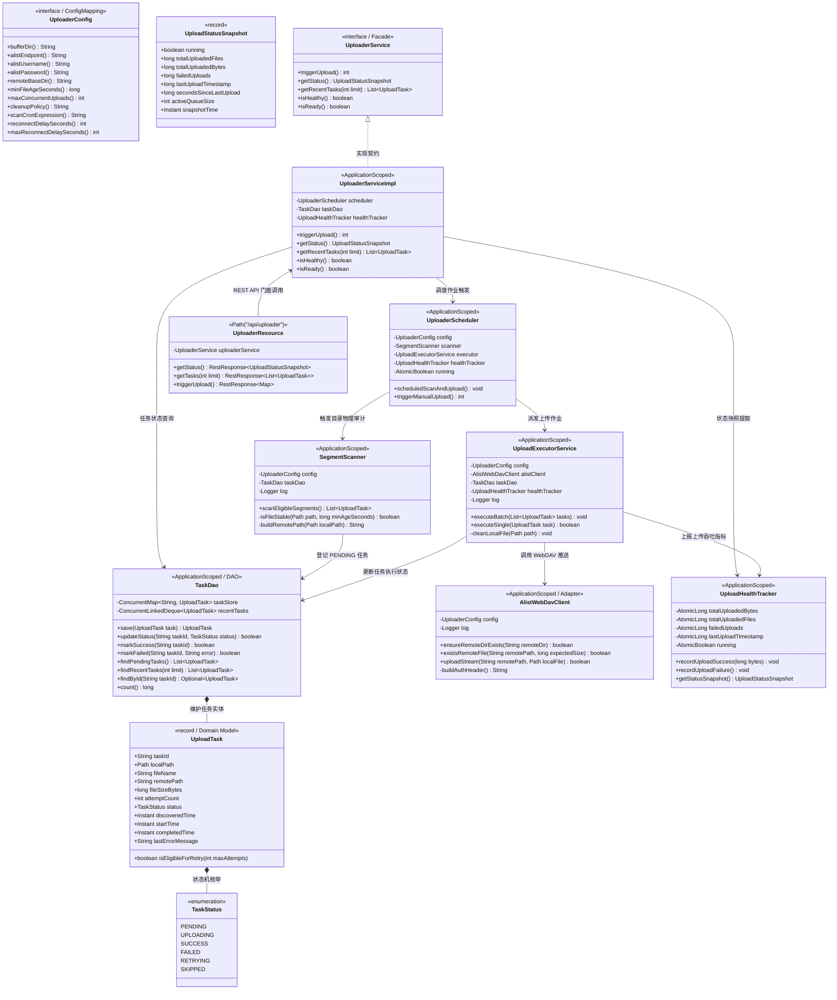
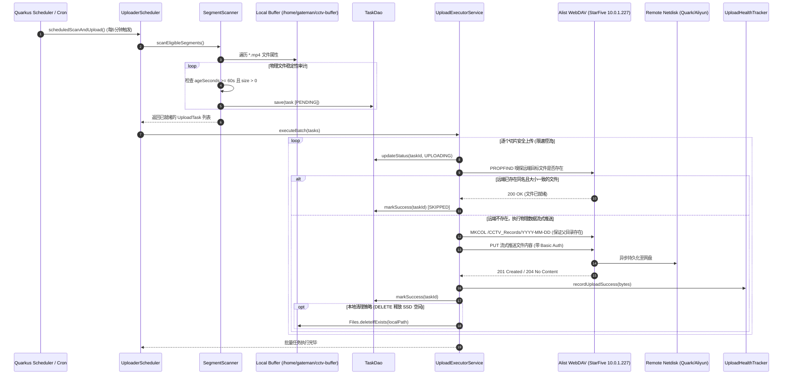
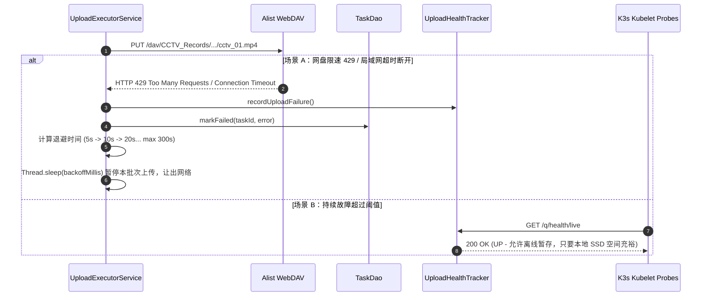
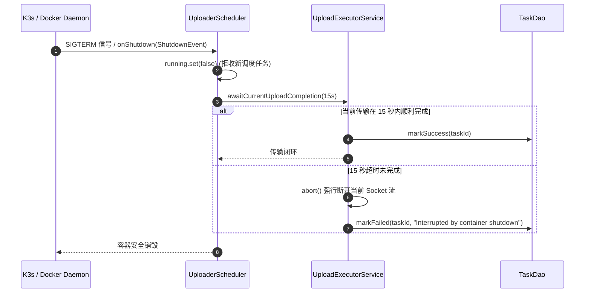
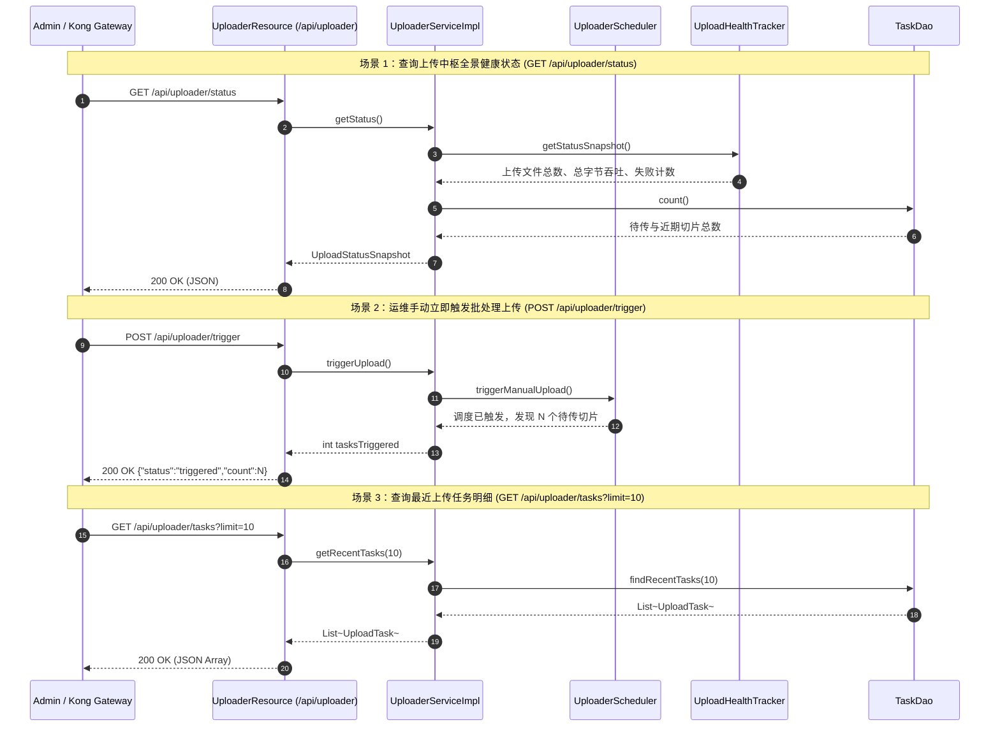

# 🏛️ CCTV Uploader 详细类设计说明书 (Class Design Document)

## 1. 设计原则与运行约束

`cctv-uploader-service` 作为整个安防流媒体管道的第二阶段（消费者与上传中枢），与采集服务（`cctv-collector-service`）通过共享的本地持久化缓冲存储卷（Radxa 外接固态硬盘 `/home/gateman/cctv-buffer`）进行无锁解耦衔接。

本服务负责将本地已安全闭合的 15 分钟 MP4 物理切片，通过局域网 **StarFive Alist 服务（`http://10.0.1.227:5244/dav/`）** 安全、可靠地异步推送至云端网盘（阿里云盘 / 百度网盘 / 夸克网盘），并在确认远端落盘无误后执行本地磁盘清理，形成 24×7 自循环闭环。

设计严格恪守以下工业级工程准则：

1. **防并发读写碰撞原则（Concurrency Isolation）**：
   - 绝不读取“正在写入中”的半成品切片；
   - 必须通过**物理文件修改时间凝固窗口（`ageSeconds >= minAgeSeconds`，默认 60 秒）**与**文件大小稳定性校验**双重防线，确认 FFmpeg 已完全闭合文件句柄后方可建单。
2. **幂等性与断点续传设计（Idempotent & Resilient Upload）**：
   - 远端路径按日期分层规划：`/CCTV_Records/YYYY-MM-DD/cctv_YYYYMMDD_HHMMSS.mp4`；
   - 上传前先进行远端元数据嗅探（`MKCOL` / `PROPFIND` / `HEAD`），若远端已存在同名且大小一致的文件，直接标记为已完成，防止重复消耗家庭上行宽带。
3. **物理存储清理防爆仓（Safe Local Eviction）**：
   - 本地切片的删除与归档必须在**远端写入确认（HTTP 201 Created / 204 No Content / 200 OK）**之后执行；
   - 磁盘清理策略支持双模可配：`DELETE`（立即删除释放空间）或 `ARCHIVE`（移动到 `.uploaded/` 归档保留 N 天）。
4. **自适应速率控制与网络退避（Rate Limiting & Backoff）**：
   - 严格控制并发上传线程数（默认单线程或最多双线程并发），防止吃满家庭宽带上行导致监控丢包或网盘触发 429 限流；
   - 遭遇局域网不可达（StarFive 掉线）或网盘限速时，执行指数退避重试（5s ➔ 10s ➔ 20s... 上限 300s）。
5. **AOT 编译与全量单测友好**：
   - 全面采用 Java 21 Record、Quarkus 3.8 REST Client Reactive 与企业级 DAO 架构，所有外部 Alist HTTP 交互均支持纯内存 Mock 单测。

---

## 2. 核心类图 (UML Class Diagram)



---

## 3. 组件时序与生命周期流 (Sequence Diagram)

### 3.1 启动与定时批量上传时序 (Scan ➔ Verify ➔ Upload ➔ Eviction)



---

### 3.2 局域网断网/网盘限速异常与指数退避时序



---

### 3.3 容器销毁与优雅停机时序 (Graceful Shutdown)



---

### 3.4 外部 REST API 交互与控制时序



---

## 4. 核心技术规格与类定义

### 4.1 `UploaderConfig` (配置映射接口)
- **包路径**：`com.gateman.cctv.uploader.config`
- **注解**：`@ConfigMapping(prefix = "cctv.uploader")`
- **设计要点**：
  - 自动绑定 `application.properties` 与 K3s 环境变量；
  - 属性映射规则（UPPER_UNDERSCORE 转换）：
    - `bufferDir()` ➔ `CCTV_UPLOADER_BUFFER_DIR`（默认 `/mnt/buffer/cctv`）；
    - `alistEndpoint()` ➔ `CCTV_UPLOADER_ALIST_ENDPOINT`（默认 `http://10.0.1.227:5244/dav`）；
    - `alistUsername()` / `alistPassword()` ➔ `CCTV_UPLOADER_ALIST_USERNAME` / `PASSWORD`；
    - `remoteBaseDir()` ➔ 远端根路径（默认 `/CCTV_Records`）；
    - `minFileAgeSeconds()` ➔ 物理文件防并发安全窗口（默认 `60` 秒）；
    - `cleanupPolicy()` ➔ 本地清理动作，可选 `DELETE` 或 `NONE`（默认 `DELETE`）；
    - `maxConcurrentUploads()` ➔ 上传并发度（默认 `1`，平滑家庭网络）；
    - `scanCronExpression()` ➔ 定时轮询表达式（默认每 5 分钟 `0 */5 * * * ?`）。

---

### 4.2 `TaskStatus` (枚举) 与 `UploadTask` (Java 21 Record)
- **包路径**：`com.gateman.cctv.uploader.model`
- **状态枚举**：
  - `PENDING`：新扫描出的稳定切片，排队等待上传；
  - `UPLOADING`：正在通过网络传输数据流；
  - `SUCCESS`：远端网盘已确认写入成功；
  - `FAILED`：传输失败，等待进入下一次退避重试；
  - `SKIPPED`：检测到远端已存在同名且大小一致文件，安全跳过。
- **Record 实体关键字段**：
  ```java
  public record UploadTask(
      String taskId,
      Path localPath,
      String fileName,
      String remotePath,
      long fileSizeBytes,
      int attemptCount,
      TaskStatus status,
      Instant discoveredTime,
      Instant startTime,
      Instant completedTime,
      String lastErrorMessage
  ) {
      public boolean isEligibleForRetry(int maxAttempts) {
          return status == TaskStatus.FAILED && attemptCount < maxAttempts;
      }
  }
  ```

---

### 4.3 `TaskDao` (企业级内存数据访问对象)
- **包路径**：`com.gateman.cctv.uploader.dao`
- **作用域**：`@ApplicationScoped`
- **定位**：企业级任务状态仓储（DAO）
- **设计要点**：
  - 基于 `ConcurrentHashMap<String, UploadTask>` 维持任务内存快照；
  - 维护有界双端队列 `ConcurrentLinkedDeque<UploadTask>` 缓存最近 200 条完成历史，供 API 微秒级呈现；
  - 提供 `findPendingTasks()` 供调度器消费。

---

### 4.4 `SegmentScanner` (物理文件审计服务)
- **包路径**：`com.gateman.cctv.uploader.service`
- **作用域**：`@ApplicationScoped`
- **职责**：
  - 扫描 `/mnt/buffer/cctv` 目录下的所有 `*.mp4` 文件；
  - 检查文件的 `lastModifiedTime`：当且仅当 `now - lastModifiedTime >= 60s` 时，判定文件已彻底摆脱 FFmpeg 写入锁定；
  - 按照文件名解析录制日期，动态规划远端路径：
    `cctv_20260920_023000.mp4` $\longrightarrow$ `/CCTV_Records/2026-09-20/cctv_20260920_023000.mp4`；
  - 将合格文件封装为 `UploadTask` 存入 `TaskDao`。

---

### 4.5 `AlistWebDavClient` (WebDAV / HTTP 传输适配器)
- **包路径**：`com.gateman.cctv.uploader.infra`
- **作用域**：`@ApplicationScoped`
- **职责**：
  - 封装与 StarFive Alist 的 HTTP / WebDAV 通信；
  - 自动拼装 `Authorization: Basic <Base64>` 请求头；
  - `boolean ensureRemoteDirExists(String remoteDir)`：自动递归发送 WebDAV `MKCOL` 命令确保远端日期目录（如 `/CCTV_Records/2026-09-20/`）存在；
  - `boolean existsRemoteFile(String remotePath, long expectedSize)`：发送 `PROPFIND` 或 `HEAD` 校验远端文件是否存在且大小吻合；
  - `boolean uploadStream(String remotePath, Path localFile)`：采用高效的 `InputStream` 块式缓冲传输，发送 WebDAV `PUT` 请求，防止大文件 OOM。

---

### 4.6 `UploadExecutorService` (批处理执行引擎)
- **包路径**：`com.gateman.cctv.uploader.service`
- **作用域**：`@ApplicationScoped`
- **职责**：
  - 限制并发控制（受 `maxConcurrentUploads` 节流保护）；
  - 执行“嗅探 ➔ 创建目录 ➔ 上传 ➔ 验证 ➔ 本地清理”的标准批处理闭环；
  - 上传成功后调用 `Files.deleteIfExists(localPath)` 清理 Radxa 本地 SSD 空间；
  - 上传失败后调用 `healthTracker.recordUploadFailure()` 并根据重试次数计算退避休眠。

---

### 4.7 `UploaderScheduler` (定时任务调度服务)
- **包路径**：`com.gateman.cctv.uploader.service`
- **作用域**：`@ApplicationScoped`
- **职责**：
  - 基于 Quarkus `@Scheduled(cron = "{cctv.uploader.scan-cron-expression}")` 每 5 分钟定时唤醒；
  - 串联 `SegmentScanner` 扫描与 `UploadExecutorService` 执行；
  - 支持 REST API 手动提前唤醒执行。

---

### 4.8 `UploadHealthTracker` (上传健康指标追踪器)
- **包路径**：`com.gateman.cctv.uploader.service`
- **作用域**：`@ApplicationScoped`
- **职责**：
  - 利用原子类型追踪累计上传文件数、累计上传字节数、失败重试次数；
  - 组装 `UploadStatusSnapshot` 只读数据快照；
  - 为 Liveness / Readiness 探针提供健康指标。

---

### 4.9 `UploaderService` (领域门面接口) 与 `UploaderServiceImpl` (实现类)
- **包路径**：`com.gateman.cctv.uploader.service`
- **职责**：
  - 统一上层业务契约，供 REST Resource 与外部调度系统调用；
  - 屏蔽底层的 WebDAV 管道流、线程池与物理磁盘操作。

---

### 4.10 `UploaderResource` (REST API 控制器)
- **包路径**：`com.gateman.cctv.uploader.resource`
- **路径**：`@Path("/api/uploader")`
- **端点规划**：
  1. `GET /api/uploader/status`：查看上传吞吐量、最近上传时间与待传任务队列；
  2. `GET /api/uploader/tasks`：查询最近历史任务清单；
  3. `POST /api/uploader/trigger`：运维人工立即触发一次扫描与全量推送。

---

### 4.11 `UploaderLivenessCheck` & `UploaderReadinessCheck` (健康检查探针)
- **包路径**：`com.gateman.cctv.uploader.health`
- **端点**：`/q/health/live` 与 `/q/health/ready`
- **设计要点**：
  - `Liveness`：评估调度服务与工作线程是否卡死；
  - `Readiness`：评估本地缓冲目录可读写性以及 StarFive Alist 局域网连通性。

---

## 5. 存储与文件状态流转规范

```text
1. 采集写入阶段 (由 cctv-collector 执行):
   /mnt/buffer/cctv/cctv_20260920_120000.mp4 (修改时间每秒跳动, WRITING)

2. 闭合凝固阶段 (由 cctv-collector 完成闭合):
   /mnt/buffer/cctv/cctv_20260920_120000.mp4 (修改时间凝固超过 60s, CLOSED)

3. 扫描入库阶段 (由 cctv-uploader.SegmentScanner 拾取):
   登记入 TaskDao ➔ 状态: PENDING

4. 传输中阶段 (由 cctv-uploader.UploadExecutorService 执行):
   PUT http://10.0.1.227:5244/dav/CCTV_Records/2026-09-20/cctv_20260920_120000.mp4
   状态: UPLOADING

5. 确认与清理阶段 (收到 HTTP 201/204):
   - TaskDao 状态变更 ➔ SUCCESS (或 SKIPPED)
   - 物理文件执行删除 ➔ Files.deleteIfExists(localPath)
   - Radxa 本地 SSD 空间立即释放，循环自愈完成！
```
